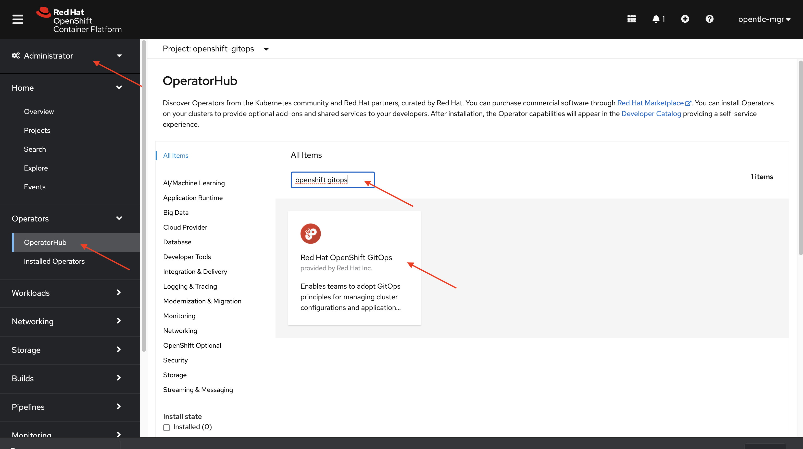
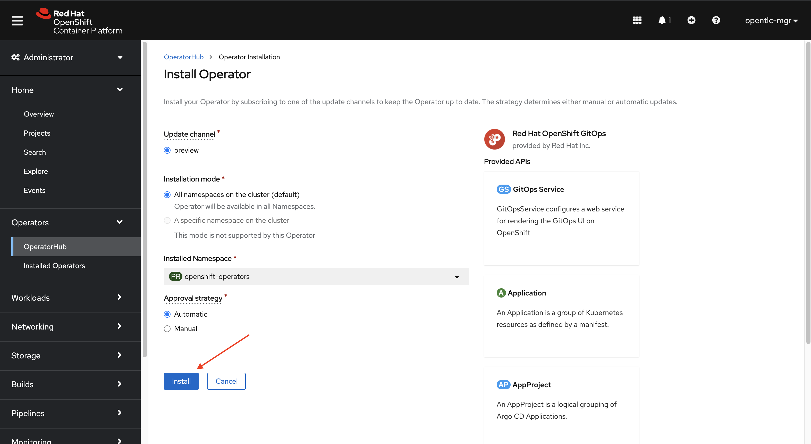
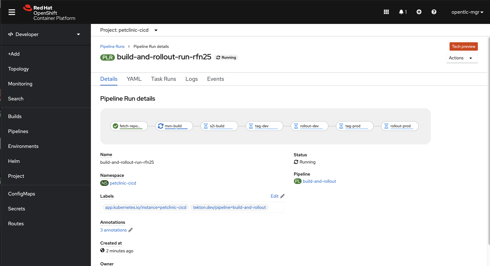

# GitOps and Serverless CI/CD with OpenShift

## What's In This Demo?

The puprose of this demo is to:

* Stand up some shared CI/CD infrastructure in an OpenShift cluster, such as:
    * Sonatype Nexus - Maven artefact repository.
    * SonarQube - Static code analysis and CVE reporting.
    * Argo CD - GitOps lifecycle management, provided by OpenShift GitOps.
    * Tekton - Serverless CI/CD, provided by OpenShift Pipelines.
* GitOps repositories to:
    * Create serverless pipelines.
    * Provision and configure application environments (dev/prod)
* Ability to use notifications from git repository manageres such as Github, GitLab, Bitbucket to trigger new builds. Coming soon!
* Ability to manually start a build with a "pipeline run" custom resource, or
* Manually trigger a build with the `tkn` command line tool.

## What You Will Need

Cluster Admin access to an OpenShift 4.6+ cluster. This has demo has been tested with:

* Red Hat OpenShift Container Platform 4.7
* Red Hat OpenShift Container Platform 4.6
* Azure Red Hat OpenShift (OpenShift 4.6)

## What You Will Do

This demo is deployed in stage:
* Install OpenShift GitOps operator
* Use the default Argo CD instance in the `openshift-gitops` namespace to deploy a "Developers" Argo CD instance.
* Use Argo CD to stand up some common tooling (Nexus and SonarQube)
* Use Argo CD to create pipelines and application environments
* Kick off a pipeline run!

## Getting Started

Select the version of OpenShift you are using to see how to install the OpenShift GitOps Operator:

* [OpenShift 4.6 (including Azure Red Hat OpenShift)](docs/01-install-gitops-operator-46.md)
* [OpenShift 4.7 (including CodeReady Containers)](docs/01-install-gitops-operator-47.md)


## Ignore everything under here for now :)

### Install the OpenShift GitOps Operator

#### Install using the OpenShift UI

1. Login to OpenShift as a user with *cluster admin* rights.
2. Make sure you are in the *Administration* view (top-left).
3. From the left menu, select **Operators -> OperatorHub**.
4. Search for "openshift gitops", then click on the "Red Hat OpenShift GitOps" tile.



5. Click the "Install" button on the blade that appears to the right.


6. Accept all defaults by clicking "Install" at the bottom of the screen.




#### Install using the CLI

Alternatly, you can install the OpenShift GitOps operator from the command line.

1. Using the `oc` command line interface, login to your cluster as a *cluster admin*.
2. Run the following command:

```
oc apply -k https://github.com/redhat-canada-gitops/catalog/openshift-gitops-operator/overlays/preview?ref=master
```

#### Installing the "Developer" instance of Argo CD

When the Red Hat OpenShift GitOps operator is installed, it will automatically do two things:

1. It will also install the latest stable version of OpenShift Pipelines (Tekton).
2. A "cluster" instance of Argo CD in the `openshift-gitops` namespace.

The "cluster" instance of Argo CD is meant for cluster administration, not really for "developers" to use.  However, we can use it to install a new instance of Argo CD for developers to use!

If you want to see what this instance of Argo CD looks like, you can find it in the `openshift-gitops` project.  You can get to the UI by clicking on the route.  The default username is `admin` and the password can be found in the `argocd-cluster` secret.

*However*, you don't have to login to get your developer instance of Argo CD up and running!

If you are logged in with the OpenShift cluster as a `cluster-admin`, you can simply run:

```
oc apply -k https://github.com/pittar-demos/gitops-and-tekton-with-openshift/argocd/argocd?ref=main
```

In just a moment, you will notice a new `argocd` project in your cluster and another instance of Argo CD spinning up in it!

Like the cluster instance, you can login to the Argo CD UI by clicking on the route that becomes available in the `argocd` project.  The default username once again is `admin` and the password can be found in the `argocd-cluster` secret.

Keep the Argo CD UI open so you can see the magic happen during the next few steps!

### Deploy Shared CI/CD Tools

There are often a few shared CI/CD tools for all projects to use.  Two good examples are Sonatype Nexus and SonarQube.

Next, we will use Argo CD to install both of these tools in a new namespace called `cicd-tools`.

To do this, run the following command:

```
oc apply -k https://github.com/pittar-demos/gitops-and-tekton-with-openshift/argocd/cicd-tools?ref=main
```

In Argo CD you will see a new `Application` appear and begin to sync!  You can take a look in your cluster at the new `cicd-tools` project to see Nexus and SonarQube spinning up.  Wait until they are both ready (dark blue circles) before continuing.

If you want to login to Nexus (not required for this demo), the default username and password is `admin`/`admin123`.  If you want to login to SonarQube (again, not require), the default username and password is `admin`/`admin`.

### Create Pipelines and Application Environments

With the base infrastructure in place, it's time to move on to the Pet Clinic application!

The next step will create three new Argo CD `Applications`.
* `petclinic-cicd` - Includes a CI/CD namespace for Pet Clinic builds and build artefacts.
* `petclinic-dev` - A `petclinic-dev` project and all configuration for the **dev** Pet Clinic environment.
* `petclinic-prod` - A `petclinic-prod` project and all configuration for the **prod** Pet Clinic environment.

To begin deploying all of this, simply run the following command:

```
oc apply -k https://github.com/pittar-demos/gitops-and-tekton-with-openshift/argocd/petclinic?ref=main
```

Once that is done, you will see the three new Argo CD `Applications` beginning to synchronize in your Argo CD UI!

This has actually done quite a bit, including:
* Creating custom Tekton *Tasks* to run maven builds, s2i builds, and tag images.
* Create a *build-and-rollout* pipeline to build the Pet Clinic from source and deploy it to the *dev* and *prod* environments.
* Create *dev* and *prod* Pet Clinic environments (`petclinic-dev` and `petclinic-prod`).

You'll notice that the "petclinic-dev" and "petclinic-prod" Argo CD projects never finish "progressing".  They might even report as "unhealthy" (red).  This is expected, since we have not yet built a Pet Clinic container image, so there is nothing to deploy!  Let's fix that...

### Building and Deploying the Pet Clinic Application

Finally, it's time to use OpenShift Pipelines!

To trigger a new build, simply run the following command:

```
oc create -f https://raw.githubusercontent.com/pittar-demos/gitops-and-tekton-with-openshift/main/pipeline-runs/build-and-rollout-pipeline-run.yaml -n petclinic-cicd
```

Now, if you switch over to the `petclinic-cicd` project in the OpenShift UI project, you should see your first pipeline run progressing!  If you click on the pipeline run link, you should see the different tasks in the pipeline and their progress, like this:



You can see there are a number of steps, including:
* Clone the git repository (fetch-repository)
* Build the app with Maven - including generating code quality and CVE reports to be sent to SonarQube
* Create a new container image (s2i-build) from the binary built by Maven
* Tag the new image as `:dev`
* Deploy (rollout) the new image to the **dev** environment
* Tag the image as `:prod`
* Deploy (rollout) the new image to the **prod** environment

Once the image has been successfully built and rolled out to **dev** and **prod**, you will notice the corresponding Argo CD `Applications` will be finished progressing and everything should be in sync!  If not, you can manually trigger a sync on each application (although, this should resolve itself automatically within 3 minutes).

You can now take a look in both the `petclinic-dev` and `petclinic-prod` OpenShift projects to see the application deployed successfully (along with MySQL databases).  You can test out each app by clicking on their respective routes and trying to add and search for pet owners.

## Wrapping It All Up

As you can see, GitOps processes combined with Serverless CI can be a very powerful one-two punch.  Not only do you get the incredible consistency of having your application environments and CI pipelines versioned in git, you also have a built-in audit trail (git history) and the piece of mind knownig that your entire environment, your CI/CD tooling, and your pipelines can be quickly, consistently and easily replicated in *any* data centre!
