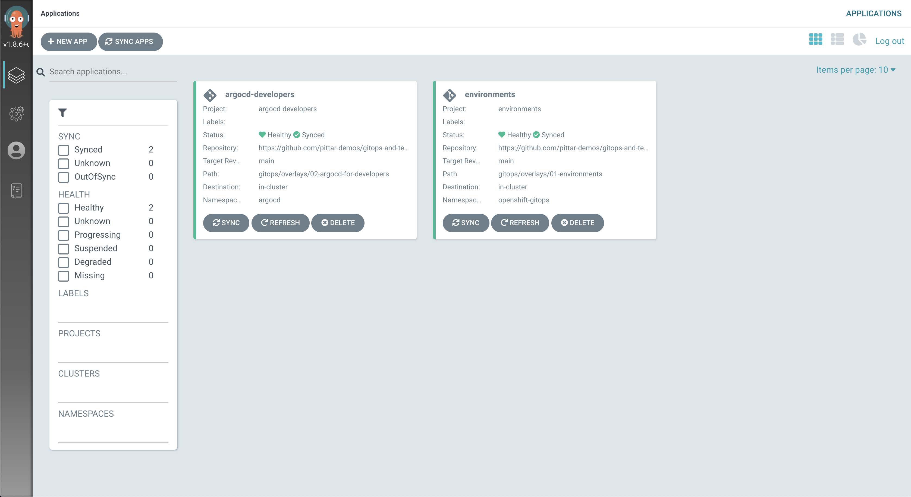

# Install Argo CD for Developers

The default "cluster" instance of Argo CD is meant for cluster admin tasks, not for day-to-day application management.  In order to manage our Pet Clinic application, we will install a new instance of Argo CD in a new `argocd` namespace.

If you are logged into your OpenShift cluster as a `cluster-admin`, you can simply run:

```
oc apply -k https://github.com/pittar-demos/gitops-and-tekton-with-openshift/gitops/argocd/01-environments
oc apply -k https://github.com/pittar-demos/gitops-and-tekton-with-openshift/gitops/argocd/02-argocd-for-developers
```

What we are doing here is using the "cluster" version of Argo CD to deploy another instance of Argo CD for developers to use!  If you have the cluster instance of Argo CD open, you should see an "argocd-devs" `Application` appear and eventually sync.  Once it is healthy and green, the new Argo CD instance in the `argocd` namespace will be ready!



Like the cluster instance, you can login to the Argo CD UI by clicking on the route that becomes available in the `argocd` project.  The default username once again is `admin` and the password can be found in the `argocd-cluster` secret.

Keep the Argo CD UI open so you can see the magic happen during the next few steps!

**Next:** [Install shared CI/CD Tools](03-install-shared-cicd-tools.md)